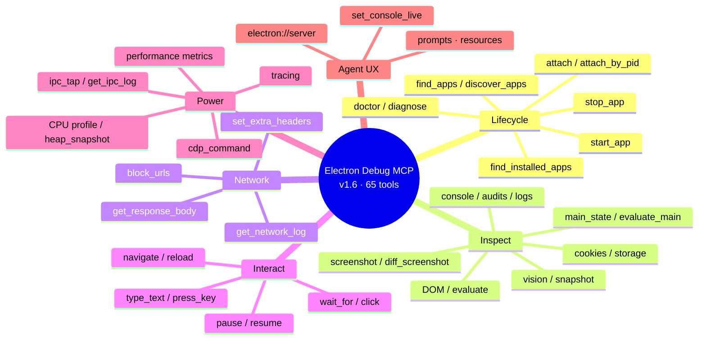
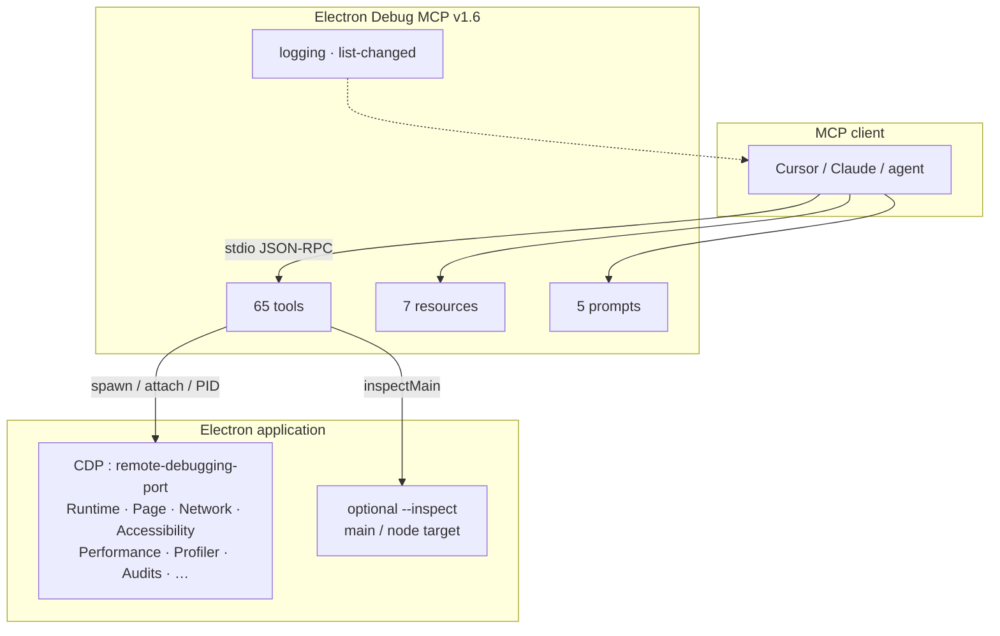
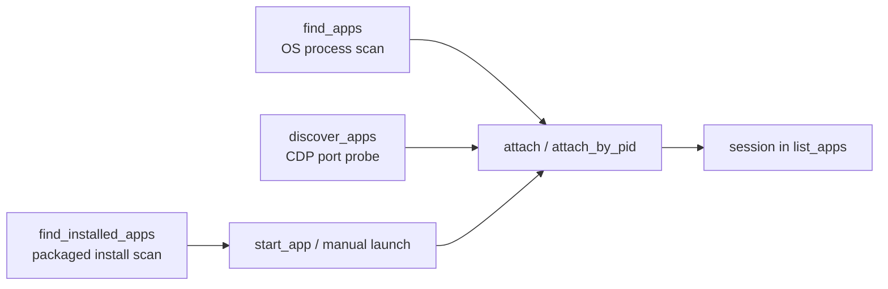
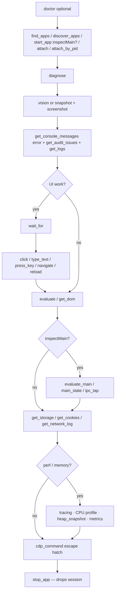
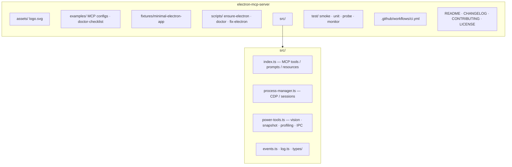

<p align="center">
  
</p>

<h1 align="center">⚡ Electron Debug MCP</h1>

<p align="center">
  <b>Debug Electron apps from Cursor &amp; Claude with real DevTools superpowers.</b><br/>
  <sub>Model Context Protocol server · Chrome DevTools Protocol · vision / a11y snapshot · profiling · IPC · audits · UI automation · main-process inspect</sub>
</p>

<p align="center">
  <a href="#-60-second-quick-start"></a>
  <a href="#-complete-tools-cheatsheet"></a>
  <a href="#-usage-examples"></a>
  <a href="#-cursor--claude-desktop-setup"></a>
  <a href="LICENSE"></a>
</p>

<p align="center">
  
  
  
  
  
  
  
</p>

---

## 🌟 Overview

**Electron Debug MCP** is a local MCP server that gives AI coding agents **eyes, hands, and Chrome DevTools** inside your Electron app.

Instead of guessing from source alone, the agent can:

| 🎯 Goal | 🛠️ How |
| --- | --- |
| Boot your app under a debugger | `start_app` with `--remote-debugging-port` |
| Hook an app you already launched | `attach` · `attach_by_pid` · `find_apps` · `discover_apps` |
| Find packaged installs | `find_installed_apps` |
| See the UI (one shot) | `vision` — screenshot + page + errors + network failures |
| A11y UI map | `snapshot` — `Accessibility.getFullAXTree` |
| See the UI (classic) | `screenshot` / `save_screenshot` / `diff_screenshot` |
| Read renderer failures | `get_console_messages` (`level: "error"`) + `get_audit_issues` |
| Stream console live | `set_console_live` → MCP log notifications |
| Inspect markup | `get_dom` / `query_selector` |
| Run JS in the page | `evaluate` |
| Run JS in **main** | `start_app({ inspectMain: true })` → `evaluate_main` / `main_state` |
| IPC observability | `ipc_tap` → `get_ipc_log` (needs `inspectMain`) |
| Cookies & web storage | `get_cookies` / `set_cookie` · `get_storage` / `set_storage` |
| Watch / shape network | `get_network_log` · `get_response_body` · `block_urls` · `set_extra_headers` |
| Drive the UI | `wait_for` → `type_text` / `press_key` → `click` → `navigate` / `reload` |
| Pause / resume JS | `pause` · `resume` (Debugger; detached after resume) |
| Read process stdout/stderr | `get_logs` |
| Perf deep-dive | `start_tracing` / CPU profile / `heap_snapshot` / `get_performance_metrics` / `perf_audit` / coverage |
| Emulate / capture | `emulate` · `start_screencast` · `capture_mhtml` · `virtual_clock` |
| Breakpoints / stacks | `set_breakpoint` · `resolve_stack` |
| Window topology | `webcontents_topology` |
| Env / session health | `doctor` · `diagnose` · `electron://server` |
| Full DevTools power | `cdp_command` (`Domain.method`) |

It speaks **MCP over stdio** (Cursor / Claude Desktop friendly), bridges to **Chrome DevTools Protocol**, buffers console + network on monitored page targets, and keeps **stdout clean** (all server logs go to **stderr**).

### 👤 Who it’s for

- 🧑‍💻 **Cursor / Claude users** pair-programming on Electron desktop apps  
- 🐛 **Maintainers** tired of “white screen / silent exception” bugs agents can’t see  
- 🧰 **Tooling authors** who need a stdio MCP ↔ CDP bridge for Electron/Chromium  

### 💬 Example things you can ask the agent

> “Start `D:/apps/my-app` on port 9222 and tell me if the renderer threw on boot.”  
> “Call `vision` and summarize what the window shows plus any console/network failures.”  
> “Take an a11y `snapshot`, then screenshot `#sidebar` and dump localStorage.”  
> “Type into `#email`, press Enter, wait for Welcome, then list console errors.”  
> “Start a CPU profile, click through settings, stop it, and save a heap snapshot.”  
> “Enable `ipc_tap`, reproduce the bug, then dump `get_ipc_log`.”  
> “Diagnose why this Electron window is blank — run `doctor` first.”

### 📊 At a glance

| Aspect | Details |
| :--- | :--- |
| 🔌 **Transport** | MCP **stdio** JSON-RPC |
| 🧬 **Debug bridge** | Chrome DevTools Protocol (Runtime · Page · Network · Debugger · Input · Log · Tracing · Accessibility · Performance · Profiler · HeapProfiler · Audits) |
| 🚀 **App control** | Spawn Electron **or** attach by port / PID / process scan |
| 📦 **Surface area** | **65 tools** · **7 resources** · **5 prompts** · logging + resource list-changed |
| 🖥️ **Platforms** | Windows · macOS · Linux (CI: **Ubuntu + Xvfb**, **Windows**, **macOS**) |
| 📦 **Requires** | Node **≥ 18**, npm, one-time Electron binary download |
| 🛡️ **Safety** | Optional `ELECTRON_MCP_ALLOWED_ROOTS` (app paths) · `ELECTRON_MCP_OUTPUT_ROOTS` (screenshot/trace output, plus built-in blocklist of sensitive locations); attach sessions detach-only on stop |
| ✅ **Verify** | `npm test` → unit + full MCP↔Electron smoke |

### ✅ Status

- 🟢 Ready for local agent-driven Electron debugging (stdio MCP ↔ CDP)
- 🟢 **v1.7.0** — 65 tools · vision loop · coverage / emulate / screencast / mhtml / topology · published on [npm](https://www.npmjs.com/package/electron-debug-mcp) (see [CHANGELOG](./CHANGELOG.md))
- 🟢 Session cleanup — stopped apps are removed from `list_apps`; CDP traces abandoned on stop/exit
- 🟢 E2E smoke covers lifecycle, UI, resources, discover, and main-process eval (see [Testing](#-testing))
- 🟢 CI: Ubuntu + Xvfb, Windows, and macOS (Node 22)
- 🟢 Windows binary repair: `scripts/fix-electron.cmd` when npm blocks postinstall
- 🟢 Built on TypeScript 7 (native Go compiler) — ~10x faster builds
- 🟢 `electron` is optional — attach-only installs can use `npm install --omit=optional`

---

## 📖 Table of contents

- [Overview](#-overview)
- [Why this exists](#-why-this-exists)
- [Feature tour](#-feature-tour)
- [60-second quick start](#-60-second-quick-start)
- [Cursor & Claude Desktop setup](#-cursor--claude-desktop-setup)
- [How it works](#-how-it-works)
- [Complete tools cheatsheet](#-complete-tools-cheatsheet)
- [Tools reference (all options)](#-tools-reference-all-options)
- [Resources](#-resources-read-only)
- [Prompts](#-prompts)
- [Usage examples](#-usage-examples)
- [Configuration](#-configuration)
- [npm scripts](#-npm-scripts)
- [Testing](#-testing)
- [Project layout](#-project-layout)
- [Security](#-security)
- [Troubleshooting](#-troubleshooting)
- [Contributing](#-contributing)
- [License](#-license)

---

## ✨ Why this exists

Electron bugs are often **invisible** to coding agents:

| 😣 Pain | 🙈 What agents usually see | 👁️ What this server adds |
| --- | --- | --- |
| Blank / white window | Source files only | **`vision`** / screenshot + DOM + a11y **`snapshot`** |
| Silent renderer crash | Nothing | **Console + exception** buffer + **Audits** issues |
| Failed API calls | Guesswork | **Network** log + **`get_response_body`** |
| Wrong route / URL | Unknown | **page_info** / `evaluate` |
| UI not responding | Can't interact | **click** / **type_text** / **press_key** / **wait_for** |
| Auth / state bugs | Blind | **cookies** + **localStorage/sessionStorage** |
| Main-process / IPC mysteries | Blind | **`main_state`** + **`ipc_tap`** |
| Perf / memory | Guesswork | **Tracing** · **CPU profile** · **heap snapshot** · **metrics** |
| UI regression | Manual eyeball | **`diff_screenshot`** vs baseline |
| App already running | Manual port hunt | **find_apps** / **attach_by_pid** / **find_installed_apps** |
| Need DevTools power | Manual only | Full **cdp_command** escape hatch |

---

## 🚀 Feature tour



<table>
<tr>
<td width="50%" valign="top">

### 🔌 Lifecycle
- ▶️ `start_app` — launch with remote debugging (+ optional `inspectMain` → pinned `--inspect` port)
- 🔗 `attach` — connect to an existing debug port
- 🆔 `attach_by_pid` — resolve port from process argv
- 🧭 `find_apps` — list Electron PIDs + debug / inspect ports
- 🔎 `discover_apps` — scan local CDP ports
- 📦 `find_installed_apps` — packaged `.app` / exe / `.desktop` scan
- ⏹️ `stop_app` — kill owned / detach attached (removes session; idempotent)
- 📋 `list_apps` — sessions, ports, buffer counts
- 🩺 `diagnose` / 🏥 `doctor` — port health + env self-check

</td>
<td width="50%" valign="top">

### 🔍 Inspection
- 👁️ `vision` — one-shot screenshot + page + errors + network failures
- ♿ `snapshot` — accessibility tree (roles / names)
- 📸 `screenshot` / 💾 `save_screenshot` / 📐 `diff_screenshot`
- 🌳 `get_dom` / `query_selector`
- 🧮 `evaluate` / `evaluate_main` / 🧠 `main_state`
- 🍪 `get_cookies` / `set_cookie` · 🗄️ `get_storage` / `set_storage`
- 🧾 `get_console_messages` · 🚨 `get_audit_issues`
- 🌐 `get_network_log` · 📄 `get_response_body`
- 📜 `get_logs` · 🎯 `list_targets` / `page_info`

</td>
</tr>
<tr>
<td width="50%" valign="top">

### 🖱️ Interaction
- 🧭 `navigate` + load wait
- ⏳ `wait_for` — selector / hidden / enabled / count / text / URL / console
- 🖱️ `click` left/right/middle
- ⌨️ `type_text` (+ clear / Enter) · `press_key` (+ modifiers)
- 🔄 `reload` · ⏸️ `pause` · ▶️ `resume`
- 🧹 `clear_buffers` (console / network / logs / ipc / audits)

</td>
<td width="50%" valign="top">

### 🧠 Agent UX & power
- 📝 MCP handshake **instructions** (+ `doctor` / `electron://server`)
- 💬 Prompts: blank window · exceptions · UI smoke · attach_and_screenshot · **vision_then_act**
- 📈 `start_tracing` / `stop_tracing`
- ⏱️ `start_cpu_profile` / `stop_cpu_profile` · 🧩 `heap_snapshot`
- 📊 `get_performance_metrics`
- 🚫 `block_urls` · 📎 `set_extra_headers`
- 📡 `ipc_tap` / `get_ipc_log`
- 🧰 `cdp_command` for any DevTools method

</td>
</tr>
</table>

## ⚡ 60-second quick start

```bash
git clone https://github.com/amafjarkasi/electron-mcp-server.git
cd electron-mcp-server
npm install
npm run ensure-electron
npm run build
npm test
```

### 🪟 Windows binary missing?

If npm warns about `allowScripts` / Electron postinstall:

```bat
.\scripts\fix-electron.cmd
```

That reinstalls Electron, extracts `electron.exe` with system `tar`, then runs tests.

---

## 🖥️ Cursor & Claude Desktop setup

### Via npm (recommended)

Published as [`electron-debug-mcp`](https://www.npmjs.com/package/electron-debug-mcp) on the public registry:

```bash
npm i -g electron-debug-mcp
# or one-shot:
npx -y electron-debug-mcp
```

Point MCP at the bin:

```json
{
  "mcpServers": {
    "electron-debug": {
      "command": "npx",
      "args": ["-y", "electron-debug-mcp"],
      "env": {
        "ELECTRON_MCP_NO_SANDBOX": "1"
      }
    }
  }
}
```

📄 Template: [`examples/cursor-mcp.json`](./examples/cursor-mcp.json) · [`examples/claude-desktop-config.json`](./examples/claude-desktop-config.json)

### From a local clone

```bash
npm install && npm run build
```

```json
{
  "mcpServers": {
    "electron-debug": {
      "command": "node",
      "args": ["/absolute/path/to/electron-mcp-server/build/index.js"],
      "env": {
        "ELECTRON_MCP_NO_SANDBOX": "1"
      }
    }
  }
}
```

📄 Template: [`examples/cursor-mcp.local.json`](./examples/cursor-mcp.local.json)

### Claude Desktop config paths

- **macOS:** `~/Library/Application Support/Claude/claude_desktop_config.json`
- **Windows:** `%APPDATA%\Claude\claude_desktop_config.json`
- **Linux:** `~/.config/Claude/claude_desktop_config.json`

> ⚠️ **Don’t** run `node build/index.js` / `npx electron-debug-mcp` in a normal terminal for daily use — it waits on stdio for an MCP client. Let Cursor/Claude spawn it.

---

## 🧩 How it works



After `start_app` / `attach` / `attach_by_pid`, page targets get **Runtime / Log / Network / Page / Audits** enabled so console, network, and audit issues keep buffering between tool calls. With `inspectMain: true`, a separate Node inspector port is opened and its `node` target is merged into `list_targets` for `evaluate_main` / `main_state` / `ipc_tap`.

**Finding a running app**



1. `find_apps` — OS process scan (Electron PIDs + `--remote-debugging-port` / `--inspect` from argv)  
2. `discover_apps` — HTTP probe of local CDP ports (`/json/version`, `/json/list`)  
3. `find_installed_apps` — packaged apps under Applications / Program Files / `.desktop`  
4. `attach` / `attach_by_pid` — open a managed session (detach-only on `stop_app`; session entry is then removed)

---

## 🗂️ Complete tools cheatsheet

| Category | Tools |
| --- | --- |
| 🚀 Lifecycle | `start_app` · `attach` · `attach_by_pid` · `find_apps` · `discover_apps` · `find_installed_apps` · `stop_app` · `list_apps` · `diagnose` · `doctor` |
| 🔍 Inspect | `screenshot` · `save_screenshot` · `diff_screenshot` · `vision` · `snapshot` · `get_dom` · `query_selector` · `evaluate` · `evaluate_main` · `main_state` · `webcontents_topology` · `get_cookies` · `set_cookie` · `get_storage` · `set_storage` · `get_console_messages` · `get_network_log` · `get_response_body` · `get_logs` · `get_audit_issues` · `list_targets` · `page_info` · `perf_audit` · `capture_mhtml` · `emulate` · `virtual_clock` · `set_file_input` · `set_breakpoint` · `resolve_stack` · coverage / screencast |
| 🖱️ Interact | `navigate` · `wait_for` · `click` · `type_text` · `press_key` · `reload` · `pause` · `resume` · `clear_buffers` · `set_console_live` |
| 🧰 Power | `start_tracing` · `stop_tracing` · `start_cpu_profile` · `stop_cpu_profile` · `heap_snapshot` · `get_performance_metrics` · `block_urls` · `set_extra_headers` · `ipc_tap` · `get_ipc_log` · `cdp_command` |
| 💬 Prompts | `debug_blank_window` · `find_renderer_exception` · `ui_smoke_check` · `attach_and_screenshot` · `vision_then_act` |

---

## 🛠️ Tools reference (all options)

All APIs below are MCP **tools**. Schemas match the live Zod definitions in `src/index.ts`.

### 🚀 Lifecycle

#### `start_app`
Launch Electron with remote debugging.

| Param | Type | Req | Default | Description |
| --- | --- | --- | --- | --- |
| `appPath` | string | ✅ | — | App directory or main script |
| `debugPort` | int `1024–65535` | ❌ | random `9222–9999` | CDP port |
| `extraArgs` | string[] | ❌ | `[]` | Extra CLI flags |
| `inspectMain` | bool | ❌ | `false` | Allocate a pinned `--inspect=<port>` and merge the main-process `node` target so `evaluate_main` works |

**Auto flags:** `--remote-debugging-port`, `--enable-logging`, `--disable-gpu`, and `--no-sandbox` when `ELECTRON_MCP_NO_SANDBOX=1` / `CI=true` / no `DISPLAY`. With `inspectMain`, also `--inspect=<inspectPort>` (separate from the Chromium debug port).

**Returns:** `id`, `pid`, `debugPort`, `inspectPort?`, `targets`, `attached: false`, …

---

#### `attach`

| Param | Type | Req | Description |
| --- | --- | --- | --- |
| `debugPort` | int | ✅ | Existing DevTools port |
| `name` | string | ❌ | Friendly session name |

`stop_app` on attached sessions **detaches only** (does not kill the external app).

---

#### `attach_by_pid`

Attach by OS process id. Resolves `--remote-debugging-port` from the process command line (Linux/macOS/`ps`, Windows PowerShell). Falls back to listening sockets owned by the PID on Linux when needed.

| Param | Type | Req | Description |
| --- | --- | --- | --- |
| `pid` | int | ✅ | Electron **main** process id |
| `name` | string | ❌ | Friendly session name |

**Tip:** Prefer the main process PID from `find_apps` (helpers with `--type=renderer` / `gpu-process` are filtered unless they expose a debug port).

---

#### `find_apps`

List running Electron-like processes.

**Returns:** `{ apps: [{ pid, command, debugPort?, inspectPort?, likelyElectron }], count }`

Use this when you launched the app yourself and don’t remember the port.

---

#### `discover_apps`

| Param | Type | Default |
| --- | --- | --- |
| `startPort` | int `1–65535` | `9222` |
| `endPort` | int `1–65535` | `9235` |

HTTP-probes each port for Chromium/Electron DevTools (`/json/version` + `/json/list`), in bounded parallel batches. Prefer a tight range around known ports (or the same port twice) when you already know where the app is listening.

---

#### `stop_app` — `{ processId }`

- **Owned** sessions (`start_app`): SIGTERM / kill the Electron process, abandon any active CDP trace, close CDP sockets, and **delete** the session from the managed map.
- **Attached** sessions: detach bookkeeping only (does not kill the external app), then delete the session.
- **Idempotent:** calling `stop_app` again after cleanup still returns success (already stopped).

#### `list_apps` — no params  

Returns managed sessions only (`id`, `name`, `status`, `pid`, `debugPort`, `inspectPort?`, buffer counts, …). Stopped sessions do **not** linger.

#### `diagnose` — optional `{ processId }` (omit = all sessions)

Reports port reachability, target role counts, recent console errors, and monitoring state.

---

### 🔍 Inspection

#### `screenshot` / `save_screenshot`

| Param | Type | Default | Description |
| --- | --- | --- | --- |
| `processId` | string ✅ | — | Session id |
| `targetId` | string | first page | CDP page target |
| `format` | `png` \| `jpeg` | `png` | Image format |
| `quality` | int `0–100` | — | JPEG only |
| `selector` | string | — | **Element clip** — capture only that node’s bounding box |
| `path` | string ✅ (`save_screenshot`) | — | File path to write |

`screenshot` returns MCP **image** content (+ JSON meta including `clip` when used).  
`save_screenshot` writes bytes to disk and returns `{ path, bytes, mimeType, clip? }`.

---

#### `get_dom` — `{ processId, selector?, targetId? }`  
#### `query_selector` — `{ processId, selector, targetId?, limit?=20 }`  

#### `evaluate`

| Param | Type | Default |
| --- | --- | --- |
| `processId` | string ✅ | — |
| `expression` | string ✅ | — |
| `targetId` | string | auto |
| `role` | `page` \| `worker` \| `browser` \| `other` | `page` |
| `returnByValue` | bool | `true` |

#### `evaluate_main`

Evaluate in the Electron **main/node** CDP target.

| Param | Type | Default |
| --- | --- | --- |
| `processId` | string ✅ | — |
| `expression` | string ✅ | — |
| `targetId` | string | auto-pick node/main |
| `returnByValue` | bool | `true` |

**Requires** a node-like target. Prefer `start_app({ inspectMain: true })`, which allocates a pinned `--inspect=<inspectPort>` (returned on the session) and merges that target into `list_targets`. You can also pass an explicit `targetId` from `list_targets`.

> Chromium’s `--remote-debugging-port` only lists page/browser targets. Main-process eval needs the separate Node inspector — that is what `inspectMain` wires up.

---

#### `get_cookies`

| Param | Type | Description |
| --- | --- | --- |
| `processId` | string ✅ | — |
| `urls` | string[] | Optional URL filter |
| `targetId` | string | Page target |

#### `set_cookie`

| Param | Type | Description |
| --- | --- | --- |
| `processId` | string ✅ | — |
| `name` / `value` | string ✅ | Cookie pair |
| `url` / `domain` | string | One required (defaults `url` to `location.href` when possible) |
| `path` | string | Cookie path |
| `secure` / `httpOnly` | bool | Flags |
| `sameSite` | `Strict` \| `Lax` \| `None` | SameSite |
| `expires` | number | Unix seconds |
| `targetId` | string | Page target |

> Note: Chromium often rejects cookies on `file://` pages — use an `http(s)` URL or pass an explicit `url`/`domain`.

---

#### `get_storage` / `set_storage`

| Param | Type | Default | Description |
| --- | --- | --- | --- |
| `processId` | string ✅ | — | — |
| `kind` | `localStorage` \| `sessionStorage` | `localStorage` | Store |
| `entries` | `Record<string,string>` ✅ (`set`) | — | Keys to write |
| `clear` | bool (`set`) | `false` | Clear store before write |
| `targetId` | string | — | Page target |

---

#### `get_console_messages` — `{ processId, tail?, level? }`  
#### `get_network_log` — `{ processId, tail? }`  
#### `get_logs` — `{ processId, tail? }`  
#### `list_targets` — `{ processId? }`  
#### `page_info` — `{ processId, targetId? }` → url / title / readyState / userAgent  

Console capture includes `console.*`, CDP Log entries, and `Runtime.exceptionThrown`.

---

### 🖱️ Interaction & control

#### `navigate` — `{ processId, url, targetId?, waitUntilLoad?=true, timeoutMs?=15000 }`

#### `wait_for`

Provide **at least one** condition:

| Param | Meaning |
| --- | --- |
| `selector` | Element must exist |
| `hidden` | Element absent or not visible |
| `enabled` | Element exists and is not disabled |
| `countSelector` + `minCount` | `querySelectorAll` length ≥ min |
| `text` | `document.body.innerText` includes |
| `urlIncludes` | `location.href` includes |
| `consoleIncludes` | Buffered console text includes |
| `timeoutMs` | Default `10000` (max `120000`) |
| `screenshotOnTimeout` | Save a PNG under the OS temp dir on failure |
| `targetId` | Page target |

#### `click` — `{ processId, selector, targetId?, button?=left }`  
#### `type_text` — `{ processId, text, selector?, clear?, pressEnter?, targetId? }`  

#### `press_key`

| Param | Type | Description |
| --- | --- | --- |
| `processId` | string ✅ | — |
| `key` | string ✅ | e.g. `Enter`, `Escape`, `Tab`, `ArrowDown`, `a` |
| `selector` | string | Focus/click before keypress |
| `modifiers` | `Alt` \| `Control` \| `Meta` \| `Shift`[] | Chord modifiers |
| `repeat` | int `1–50` | Repeat count |
| `targetId` | string | Page target |

#### `set_console_live` — `{ enabled }`  
Errors/asserts **always** emit MCP logs. When enabled, log/info/warn/debug also stream live.

#### `reload` — `{ processId, targetId?, ignoreCache?=false }`  

Reloads **page** targets only (never the main-process `node` inspect target). Omit `targetId` to reload every page-like target.

#### `pause` / `resume` — `{ processId, targetId? }`  

`Debugger.pause` / `Debugger.resume` on a page target. `resume` also calls `Debugger.disable` afterward so later screenshots / input are not blocked by an open debugger session.

#### `clear_buffers` — `{ processId, console?, network?, logs?, ipc?, audits? }`  

Clears in-memory buffers. With no flags, clears console + network. Set `logs` / `ipc` / `audits` explicitly when needed.

---

### 🧰 Power / tracing / profiling (v1.6)

#### `vision` — `{ processId, targetId?, includeScreenshot?=true }`

One-shot agent view: page info, windows, recent console errors, network failures, audit issues, plus an MCP **image** when screenshot succeeds.

#### `snapshot` — `{ processId, depth?, targetId? }`

CDP `Accessibility.getFullAXTree` → roles / names / backend node ids (agent-friendly UI map).

#### `diff_screenshot` — `{ processId, baselinePath, currentPath?, selector?, targetId? }`

Compare a baseline PNG to a fresh capture (or an existing `currentPath`). Returns `identical`, byte `similarity`, and SHA-256s.

#### `get_response_body` — `{ processId, requestId, targetId? }`  
#### `block_urls` — `{ processId, urls[], targetId? }`  
#### `set_extra_headers` — `{ processId, headers{}, targetId? }`  
#### `get_performance_metrics` — `{ processId, targetId? }` → `Performance.getMetrics` map  
#### `get_audit_issues` — `{ processId, tail? }` — buffered Chromium Audits issues  

#### `start_cpu_profile` / `stop_cpu_profile` — `{ processId, targetId? }` / `{ processId, path? }`  
Writes a `.cpuprofile` under the output-path rules (default: OS temp).

#### `heap_snapshot` — `{ processId, path?, targetId? }`  
Writes a `.heapsnapshot` for DevTools Memory analysis.

#### `main_state` — `{ processId }`  
Electron nervous system via `evaluate_main`: windows, `app.getPath(*)`, versions, metrics. Requires a main/node target (`inspectMain: true`).

#### `ipc_tap` / `get_ipc_log` — `{ processId }` / `{ processId, tail?, refreshFromMain? }`  
Installs a main-process IPC tap; drain with `get_ipc_log`. Requires `inspectMain`.

#### `find_installed_apps` — `{}`  
Best-effort scan of packaged Electron installs (macOS `.app`, Windows dirs, Linux `.desktop`).

#### `start_tracing`

| Param | Type | Description |
| --- | --- | --- |
| `processId` | string ✅ | — |
| `categories` | string | Comma-separated CDP categories (default: timeline + v8 profiler set) |
| `targetId` | string | Page target |

Only one active trace per process session.

#### `stop_tracing`

| Param | Type | Description |
| --- | --- | --- |
| `processId` | string ✅ | — |
| `path` | string | Output JSON path (default: OS temp dir) |

**Returns:** `{ path, eventCount, elapsedMs, targetId, … }`  
Open the file in Chrome’s `chrome://tracing` (or Perfetto UI).

#### `cdp_command` — `{ processId, method:"Domain.method", targetId?, params? }`

Escape hatch for any DevTools method not wrapped above.

---

## 📡 Resources (read-only)

| URI | MIME | Description |
| --- | --- | --- |
| `electron://server` | JSON | Package version, uptime, Node/platform, capability counts |
| `electron://info` | JSON | Managed processes overview |
| `electron://targets` | JSON | All CDP targets |
| `electron://process/{id}` | JSON | Process details + webContents + recent errors |
| `electron://logs/{id}` | text | stdout/stderr capture |
| `electron://console/{id}` | JSON | Buffered console / exceptions |
| `electron://cdp/{processId}/{targetId}` | JSON | Target metadata |

---

## 💬 Prompts

| Prompt | Args | Use when |
| --- | --- | --- |
| `debug_blank_window` | `processId` | White/blank window |
| `find_renderer_exception` | `processId` | Hunting console/exceptions |
| `ui_smoke_check` | `processId`, `selector` | Wait → interact → verify |
| `attach_and_screenshot` | `processId?`, `debugPort?` | Find/attach → screenshot + console errors |
| `vision_then_act` | `processId`, `goal` | vision → snapshot → act → verify loop |

---

## 📚 Usage examples

### 1️⃣ Start app → read title

```json
// tool: start_app
{
  "appPath": "D:/apps/my-electron-app",
  "debugPort": 9222,
  "extraArgs": ["--no-sandbox"]
}
```

```json
// tool: evaluate
{
  "processId": "electron-1710000000000",
  "expression": "document.title"
}
```

### 2️⃣ Attach to a running app (port)

```bash
electron . --remote-debugging-port=9222
```

```json
// tool: attach
{ "debugPort": 9222, "name": "my-app" }
```

### 3️⃣ Find by PID → attach

```json
// tool: find_apps
{}
```

```json
// tool: attach_by_pid
{ "pid": 43210, "name": "my-app" }
```

### 4️⃣ Catch console errors (+ live stream)

```json
// tool: set_console_live
{ "enabled": true }
```

```json
// tool: get_console_messages
{
  "processId": "electron-1710000000000",
  "level": "error",
  "tail": 50
}
```

Also: resource `electron://console/{processId}`

### 5️⃣ Screenshot — full page, file, or element

```json
// tool: screenshot
{ "processId": "electron-…", "format": "png" }
```

```json
// tool: save_screenshot
{
  "processId": "electron-…",
  "path": "D:/tmp/app.png",
  "format": "png"
}
```

```json
// tool: save_screenshot (element clip)
{
  "processId": "electron-…",
  "path": "D:/tmp/sidebar.png",
  "selector": "#sidebar"
}
```

### 6️⃣ UI automation flow

```json
// wait_for
{ "processId": "electron-…", "selector": "#email", "timeoutMs": 8000 }
```

```json
// type_text
{
  "processId": "electron-…",
  "selector": "#email",
  "text": "ada@example.com",
  "clear": true
}
```

```json
// press_key
{ "processId": "electron-…", "key": "Enter" }
```

```json
// click
{ "processId": "electron-…", "selector": "button[type=submit]" }
```

```json
// wait_for (richer conditions)
{
  "processId": "electron-…",
  "text": "Welcome",
  "timeoutMs": 8000,
  "screenshotOnTimeout": true
}
```

```json
// wait_for enabled / count / hidden
{ "processId": "electron-…", "enabled": "#submit" }
```

```json
{
  "processId": "electron-…",
  "countSelector": ".row",
  "minCount": 3
}
```

```json
{ "processId": "electron-…", "hidden": ".spinner" }
```

### 7️⃣ Cookies & storage

```json
// set_storage
{
  "processId": "electron-…",
  "kind": "localStorage",
  "clear": true,
  "entries": { "theme": "dark", "onboardingDone": "1" }
}
```

```json
// get_storage
{ "processId": "electron-…", "kind": "localStorage" }
```

```json
// set_cookie
{
  "processId": "electron-…",
  "name": "session",
  "value": "abc",
  "url": "https://app.local/"
}
```

```json
// get_cookies
{ "processId": "electron-…", "urls": ["https://app.local/"] }
```

### 8️⃣ Main-process evaluate

```json
// start_app with inspectMain
{
  "appPath": "D:/apps/my-electron-app",
  "debugPort": 9222,
  "inspectMain": true
}
```

```json
// evaluate_main
{
  "processId": "electron-…",
  "expression": "process.versions.electron"
}
```

### 9️⃣ Performance tracing

```json
// start_tracing
{ "processId": "electron-…" }
```

```text
…reproduce the slow interaction (click / navigate / wait_for)…
```

```json
// stop_tracing
{
  "processId": "electron-…",
  "path": "D:/tmp/app-trace.json"
}
```

Open `app-trace.json` in `chrome://tracing`.

### 🔟 Diagnose a sick session

```json
// tool: diagnose
{ "processId": "electron-1710000000000" }
```

### 1️⃣1️⃣ Navigate · reload · pause / resume · page info

```json
// navigate
{
  "processId": "electron-…",
  "url": "file:///path/to/renderer/settings.html",
  "waitUntilLoad": true
}
```

```json
// reload
{ "processId": "electron-…", "ignoreCache": false }
```

```json
// pause then resume (page JS)
{ "processId": "electron-…" }
```

```json
// page_info
{ "processId": "electron-…" }
```

```json
// get_logs (Electron stdout/stderr)
{ "processId": "electron-…", "tail": 100 }
```

### 1️⃣2️⃣ Raw CDP escape hatch

```json
// cdp_command
{
  "processId": "electron-…",
  "method": "Page.captureScreenshot",
  "params": { "format": "png", "fromSurface": true }
}
```

### 1️⃣3️⃣ Recommended agent loop



### 1️⃣4️⃣ Vision · a11y · profiling · IPC (v1.6)

```json
// vision — image + JSON summary
{ "processId": "electron-…", "includeScreenshot": true }
```

```json
// snapshot — accessibility tree
{ "processId": "electron-…", "depth": 12 }
```

```json
// start_cpu_profile → …reproduce… → stop_cpu_profile
{ "processId": "electron-…" }
```

```json
// heap_snapshot
{ "processId": "electron-…", "path": "D:/tmp/app.heapsnapshot" }
```

```json
// main_state + ipc_tap (requires inspectMain)
{ "processId": "electron-…" }
```

```json
// diff_screenshot vs baseline
{
  "processId": "electron-…",
  "baselinePath": "D:/tmp/baseline.png"
}
```

```json
// block analytics noise
{
  "processId": "electron-…",
  "urls": ["*://*.google-analytics.com/*", "*://*.sentry.io/*"]
}
```

---

## 🔐 Configuration

### Environment variables

| Variable | Purpose |
| --- | --- |
| `ELECTRON_PATH` | Force a specific Electron binary |
| `ELECTRON_MCP_NO_SANDBOX=1` | Always pass `--no-sandbox` |
| `ELECTRON_MCP_ALLOWED_ROOTS` | `;` / `\|` allowlist for `start_app` paths (unset = unrestricted) |
| `ELECTRON_MCP_OUTPUT_ROOTS` | `;` / `\|` allowlist for `save_screenshot` / `stop_tracing` paths (still subject to the built-in sensitive-path blocklist) |
| `ELECTRON_MIRROR` | Download mirror for Electron zips |
| `ELECTRON_SKIP_BINARY_DOWNLOAD` | Cleared by `ensure-electron` so download still runs |
| `ELECTRON_CACHE` / `electron_config_cache` | Zip cache directory |
| `CI=true` | Enables no-sandbox auto flag |
| unset `DISPLAY` (Linux) | Enables no-sandbox auto flag |

### Path allowlist example

```powershell
$env:ELECTRON_MCP_ALLOWED_ROOTS="D:\apps;D:\GH"
```

---

## 📜 npm scripts

| Script | Does |
| --- | --- |
| `npm run ensure-electron` | Download/repair Electron binary |
| `npm run fix-electron` | Alias of ensure-electron |
| `npm run build` | Compile TS → `build/` |
| `npm start` | Run MCP server (stdio) |
| `npm run dev` | build + start |
| `npm run typecheck` | `tsc --noEmit` |
| `npm test` | ensure + build + unit + smoke |
| `npm run test:unit` | Unit tests (`unit-helpers`, `probe`, `monitor`) |
| `npm run test:smoke` | Full MCP e2e vs fixture app |
| `npm run doctor` | Build + stdio self-check (`doctor` tool + `electron://server`) |
| `npm run pack:check` | `npm pack --dry-run` (publish surface) |
| `prepublishOnly` | Builds before `npm publish` |
| `postinstall` | Runs ensure-electron (no-op if electron omitted) |

**Windows helpers:** `scripts/fix-electron.cmd` · `scripts/fix-electron.ps1`

---

## 🧪 Testing

```bash
npm test
```

Smoke path (v1.6):

`initialize` → tool/prompt/resource lists (`doctor`, `electron://server`) → `start_app` (`inspectMain`) → evaluate → console/network/DOM → UI automation → `save_screenshot` (+ **selector clip**) → storage / cookies → tracing → `find_apps` / `attach_by_pid` → `get_logs` → screenshot → diagnose → **`snapshot` / `vision` / metrics / CPU profile / heap / network shaping / audits / `find_installed_apps` / `diff_screenshot`** → navigate / reload / pause / resume / cdp / **`evaluate_main` / `main_state` / `ipc_tap`** → attach → discover → **all 7 resources** → stop → post-stop cleanup

Unit tests also cover CDP monitor hang-regression (`test/monitor.test.mjs`).

CI: [`.github/workflows/ci.yml`](./.github/workflows/ci.yml) — **Ubuntu + Xvfb**, **Windows**, and **macOS** (`npm test` + `npm pack --dry-run`).

---

## 🗂️ Project layout



Published npm package includes `build/`, `assets/`, `README.md`, `LICENSE`, and `CHANGELOG.md` (`files` + `.npmignore`). `electron` is an **optionalDependency** so `start_app` works after a normal install; attach-only users can `npm install --omit=optional` and skip the Electron download.

**Release:** bump `package.json` → merge to `master` → tag `vX.Y.Z` matching that version. [`.github/workflows/publish.yml`](./.github/workflows/publish.yml) runs `npm stage publish` (repo secret `NPM_TOKEN`). A maintainer then promotes with OTP:

```bash
npm stage list
npm stage approve <stage-id> --otp=<code>
```

---

## 🛡️ Security

- Can launch local binaries, evaluate JS in app contexts, read page content, cookies, and storage — treat as a **powerful local debugger**.
- Use `ELECTRON_MCP_ALLOWED_ROOTS` on shared machines.
- `save_screenshot` / `stop_tracing` reject writes under credential/system roots (`~/.ssh`, `~/.aws`, `~/.gnupg`, `~/.kube`, `~/.docker`, `/etc`, `/proc`, `/usr`, `/root`, `C:\Windows`, `C:\Program Files`, …), resolve symlinks on existing ancestors, and honour `ELECTRON_MCP_OUTPUT_ROOTS` when set.
- Stopped sessions are removed from the managed map (no stale `list_apps` entries); in-progress CDP traces are abandoned on stop/exit.
- Don’t expose stdio over an open network without auth.
- Only `attach` / `attach_by_pid` to apps you trust (remote debugging is powerful).
- In-memory console/network buffers and exported traces may contain secrets from the app under test.

---

## 🧯 Troubleshooting

| Symptom | Fix |
| --- | --- |
| `Electron failed to install correctly` | `.\scripts\fix-electron.cmd` / `npm run ensure-electron` |
| `path.txt` missing / `dist=locales` | Corrupt cache — repair script clears + uses `tar` |
| `allowScripts` warning | Expected on newer npm — run ensure/fix scripts |
| Hang + console title `Select …` | Windows QuickEdit — press Esc; disable QuickEdit |
| Empty console buffer | Wait for page activity; monitoring starts on start/attach; try `set_console_live` |
| `wait_for` / `click` fails | Selector not ready — wait first; screenshot to verify |
| Element screenshot hangs / times out | Headless/GPU quirks — server retries without `fromSurface`; ensure selector is visible |
| `set_cookie` fails on `file://` | Pass an `http(s)` `url`/`domain` |
| `evaluate_main` “No main/node target” | Restart with `inspectMain: true` (pinned `--inspect` port) or pass `targetId` from `list_targets` |
| Screenshot fails after `pause` | Call `resume` (it disables Debugger); capture before pausing when possible |
| `attach_by_pid` can’t resolve port | App must be started with `--remote-debugging-port`; check `find_apps` |
| `start_app` path rejected | Outside `ELECTRON_MCP_ALLOWED_ROOTS` |
| Output path “sensitive location” / outside roots | Avoid `~/.ssh`, `~/.aws`, system dirs; or set `ELECTRON_MCP_OUTPUT_ROOTS` |
| `node build/index.js` “does nothing” | Waiting on MCP stdio — use Cursor config |
| Port in use | Change `debugPort` or `discover_apps` / `find_apps` |
| Linux headless | `ELECTRON_MCP_NO_SANDBOX=1` + Xvfb |
| Tracing empty / fails | Call `start_tracing` before the slow path; only one active trace per session |
| `main_state` / `ipc_tap` fail | Need `inspectMain: true` (or an attachable node target) |
| `heap_snapshot` / CPU profile empty | Wait briefly after start; ensure page target is alive |
| `get_response_body` fails | Use a `requestId` after `loadingFinished` / response events |
| `list_apps` empty after stop | Expected — sessions are deleted on stop/exit |

---

## 🤝 Contributing

1. Fork + branch  
2. `npm test`  
3. PR with tool/behavior notes  
4. Keep stdout MCP-clean (log to stderr only)

---

## 📄 License

[ISC](./LICENSE) © Electron Debug MCP contributors

---

<p align="center">
  <br/>
  <b>Built for agents that need eyes — and hands — inside Electron.</b>
</p>
